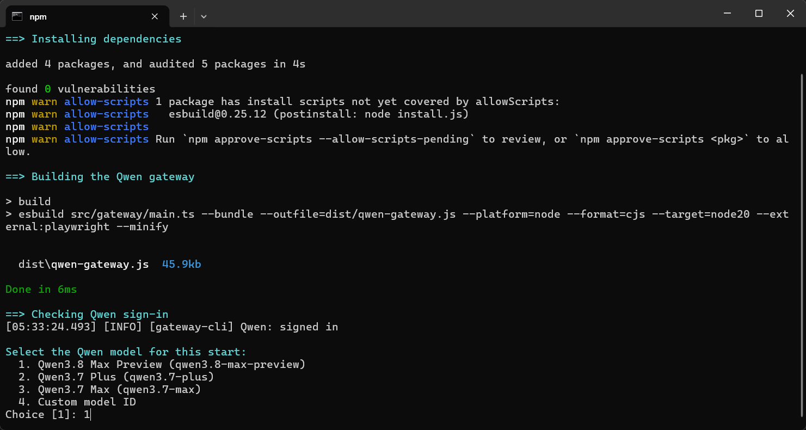
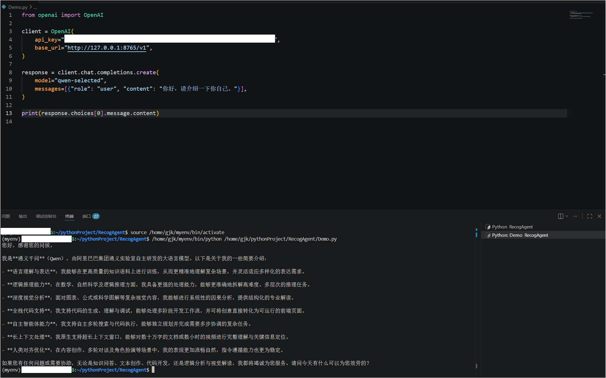

# Qwen OpenAI Gateway

A lightweight gateway that exposes Qwen Web through an OpenAI-compatible API.
It can be used by AstrBot or any client that supports a custom OpenAI base URL.

## Requirements

- Windows 10/11
- Node.js 20+
- Google Chrome

## Quick Start

Run:

```bat
start-qwen-gateway.cmd
```

The script installs dependencies, builds the gateway, opens Qwen sign-in when
needed, asks which model to use, and starts the server.

Configure your OpenAI-compatible client with the values printed in the terminal:

```text
Base URL: http://127.0.0.1:8765/v1
API Key:  <generated key>
Model:    qwen-selected
```





## API

```text
GET  /health
GET  /v1/models
POST /v1/chat/completions
```

Streaming responses, tools/function calls, image input, and Qwen reasoning
output are supported.

## Commands

```bash
npm install --no-package-lock
npm run build
npm run login
npm start
```

Additional commands:

```bash
npm run status
npm run logout
```

## Environment Variables

```text
QWEN_GATEWAY_HOST
QWEN_GATEWAY_PORT
QWEN_GATEWAY_API_KEY
QWEN_GATEWAY_MODEL
QWEN_GATEWAY_BROWSER_MODE
QWEN_GATEWAY_DATA_DIR
QWEN_GATEWAY_LOGIN_TIMEOUT_MS
QWEN_GATEWAY_DEBUG
```

Runtime data is stored in `%USERPROFILE%\.qwen-astrbot-gateway` by default.
